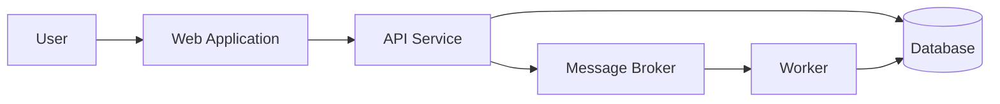

# Architecture Documentation

## Recommended views

### System Context
Document users, actors, external systems, major boundaries and system purpose.

### Container
Document applications, services, data stores, responsibilities and major technology choices.

### Component
Use when a container contains meaningful architectural complexity.

### Deployment
Document environments, deployment nodes, networking, compute, data services, DNS, load balancing and observability.

## Diagram review

Every diagram should have a title, scope, intended audience, named elements, labelled relationships, understandable abbreviations and an appropriate abstraction level.

## Example

