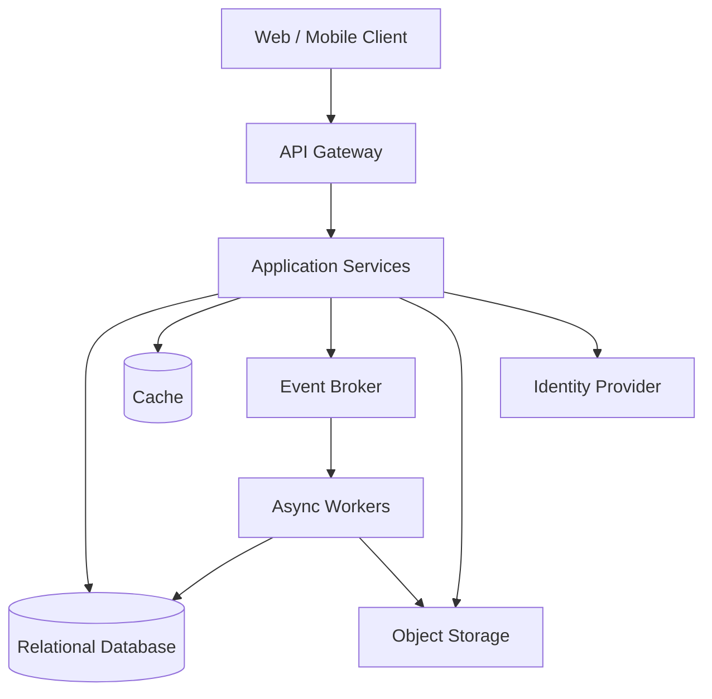

# Container View — Generic SaaS Platform

```mermaid
flowchart TB
    Client[Web / Mobile Client]
    Gateway[API Gateway]
    App[Application Services]
    Worker[Async Workers]
    DB[(Relational Database)]
    Cache[(Cache)]
    Broker[Event Broker]
    Object[Object Storage]
    IdP[Identity Provider]

    Client --> Gateway
    Gateway --> App
    App --> DB
    App --> Cache
    App --> Broker
    App --> Object
    App --> IdP
    Broker --> Worker
    Worker --> DB
    Worker --> Object
```
