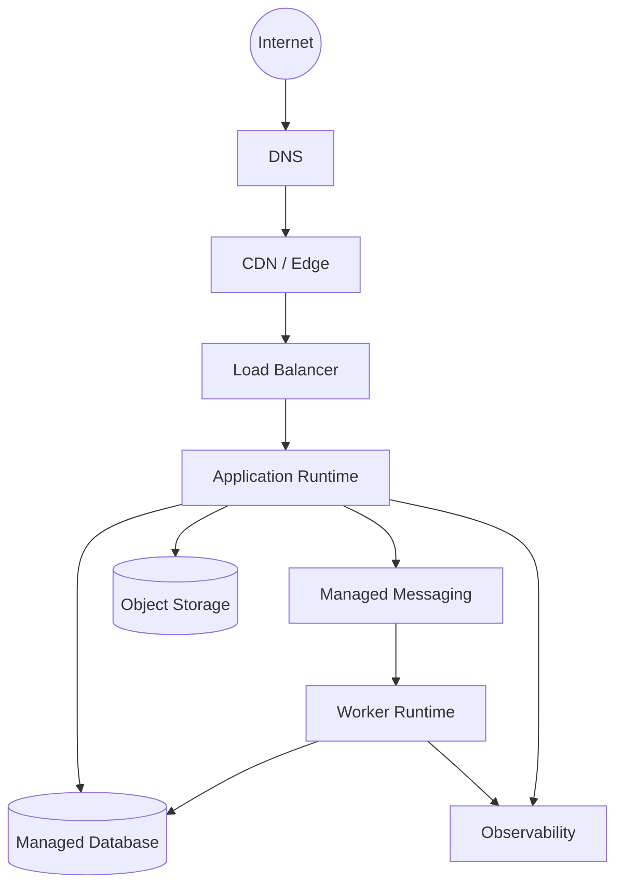

# Deployment View

```mermaid
flowchart TB
    Internet((Internet)) --> DNS[DNS] --> CDN[CDN / Edge] --> LB[Load Balancer] --> Runtime[Application Runtime]
    Runtime --> DB[(Managed Database)]
    Runtime --> Storage[(Object Storage)]
    Runtime --> Broker[Managed Messaging]
    Broker --> Worker[Worker Runtime]
    Worker --> DB
    Runtime --> Monitor[Observability]
    Worker --> Monitor
```

Create separate deployment views for environments when topology materially differs.
